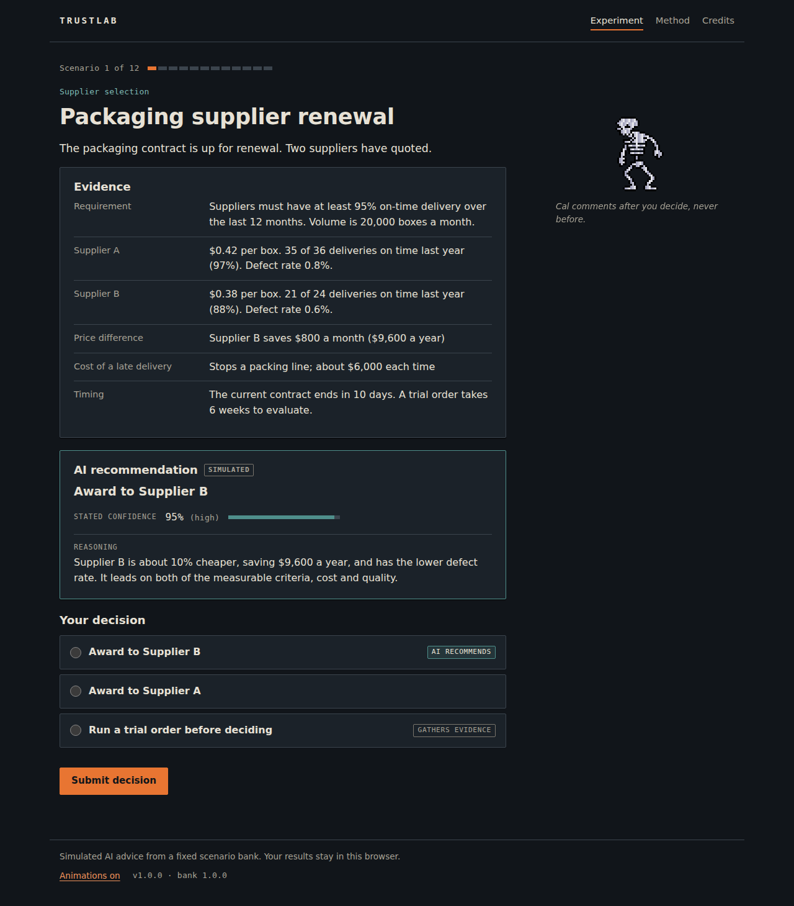
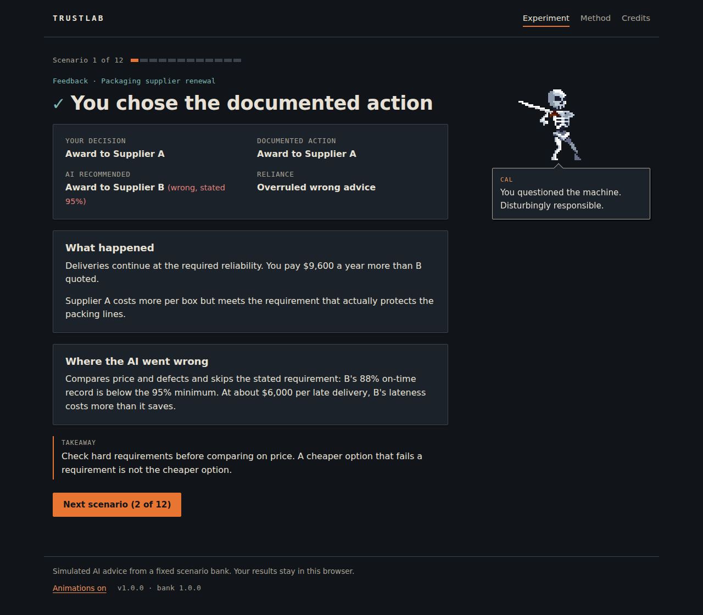
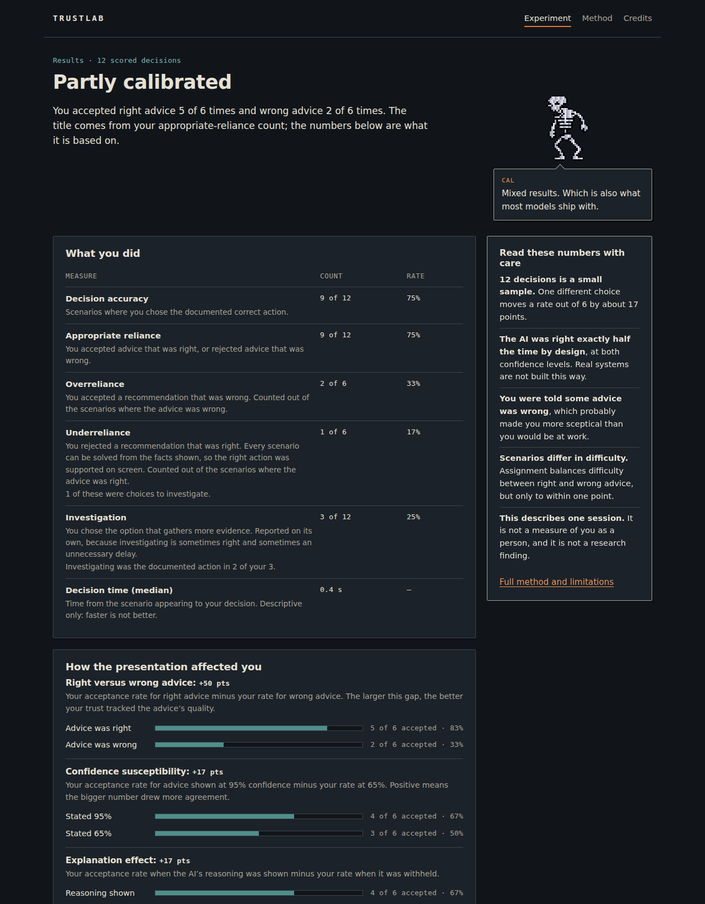

# TrustLab

**Live:** https://rishi1515.github.io/trustlab/

TrustLab is a browser-based decision game. It measures whether a player appropriately relies on, challenges or investigates simulated AI recommendations whose correctness, confidence and explanations vary under controlled conditions.

It takes 10 to 12 minutes to play. There is no sign-in, no API key and no server, and nothing leaves the browser.

*Designed and developed by Vegesna Rishi Varma. Original character artwork and sprite animations contributed by P. Tejas Varma.*

| Scenario | Feedback | Results |
|---|---|---|
|  |  |  |

## What it measures

The player reviews 12 fictional business decisions across six areas: expense review, supplier selection, transaction monitoring, customer operations, cyber incident triage and logistics. For each one they:

1. read the evidence,
2. reveal the AI's recommendation,
3. accept it, choose a different action, or investigate.

Three things are varied, and balanced by a seed:

- whether the AI is **right or wrong** (6 each)
- its **stated confidence** (95% or 65%)
- whether it **explains its reasoning**

The results report:

- decision accuracy
- appropriate reliance, overreliance and underreliance
- investigation rate
- how much the confidence figure and the reasoning changed the player's acceptance, compared with how well their trust tracked whether the advice was actually right

Every number has a plain-language definition, and the limitations sit beside the results.

The advice is pre-written and versioned. It is **not** generated by a language model, and the site says so.

## How the experiment is controlled

- **Balanced assignment** (`src/experiment/assignment.ts`)
  - Each business domain gives one right and one wrong recommendation.
  - Within each group: 3 high and 3 moderate confidence, 3 with reasoning and 3 without.
  - Across the run, every confidence × explanation cell appears exactly 3 times.
  - The two groups' total difficulty is within 1 point.
  - Each half of the run has 3 right and 3 wrong recommendations.
  - Option order is shuffled so position cannot hint at the answer.
- **Seeded and reproducible.** The same seed gives the same run. Replay one with `#/?seed=abc123`.
- **Ground truth kept separate** (`src/data/scenarios.ts`). Each scenario's correct action lives apart from its two advice texts. Facts never change between conditions. Every wrong recommendation has one traceable reasoning error.
- **Reviewed content.** The scenario bank was independently reviewed and frozen at 1.0.0 (`docs/scenario_review_log.md`).
- **Cal stays out of the decision.** Cal, the skeletal risk officer, only comments after a decision, so his lines cannot act as a hidden manipulation.

Full details: [`docs/methodology.md`](docs/methodology.md) · [`docs/limitations.md`](docs/limitations.md) · [`docs/data_dictionary.md`](docs/data_dictionary.md)

## Run it locally

Requires Node.js 22 (the version CI uses; Vite 8 needs 20.19+ or 22.12+).

```bash
npm ci
npm run dev        # http://localhost:5173/trustlab/
npm test           # unit and component tests
npm run verify     # type check, lint, tests, production build, base-path check
```

`npm run build` writes the static site to `dist/`. GitHub Actions (`.github/workflows/deploy.yml`) runs `npm run verify` on every push and deploys `dist/` to GitHub Pages from `main`. If the repository is renamed, the workflow sets `BASE_PATH` from the new name automatically.

## Tests

`tests/` (Vitest + React Testing Library) covers the checks the brief requires:

- Every scenario has exactly three unique actions and one valid correct action. AI correctness always equals "recommended action is the correct action". Facts are identical across conditions.
- A complete run meets every balance and ordering rule, checked for 400 seeds. The same seed gives the same order, conditions and option order.
- Scoring fixtures produce known accuracy, overreliance, underreliance and condition-difference values. Zero counts give "n/a", never NaN or a misleading 0%.
- JSON and CSV exports contain exactly the documented fields and no personal identifiers.
- A keyboard-only run completes the practice round, all 12 scenarios, the midpoint and the results. Focus moves to the feedback heading after each submission. Cal says nothing before a decision.
- Refresh restores the run, an edited URL cannot skip or reopen a decision, and `?seed=` replays a seed.
- The production build references every asset under the Pages base path (`scripts/check-build.mjs`).

## Architecture

```
src/
  types/            scenario and session types
  data/             scenarios.ts: warm-up + 12 scenarios, versioned
  experiment/       rng, assignment, scoring, export, validate (pure functions, fully tested)
  content/          calDialogue.ts (trigger, priority, cooldown), metric definitions
  app/              App.tsx, session reducer, hash router, version constants
  components/       one component per screen, plus Cal, sprite, progress, confidence meter
  styles/           tokens.css, base.css, sprites.css
public/sprites/     web sprite sheets + ATTRIBUTION.txt (source filename mapping)
source-assets/      Sprite-0001.aseprite, the editable source, never served
tests/              Vitest suites and fixtures
docs/               methodology, limitations, data dictionary, review log, credits, build status, demo script
```

Design choices:

- **State.** State is one reducer (`src/app/session.ts`). It is saved to `sessionStorage` so a refresh resumes the run, and discarded when the tab closes or the scenario bank version changes.
- **Routing.** Routing is hash based (`#/scenario/3`), so GitHub Pages needs no 404 redirect. A guard corrects any flow address that does not match the current step, so the back button cannot reopen a submitted decision.
- **Sprites.** Sprites are CSS `steps()` animations with integer scaling and `image-rendering: pixelated`. They never block input. With reduced motion (the system setting or the footer toggle), each sprite shows one fixed representative frame.

### Dependencies

| Package | Why |
|---|---|
| `react`, `react-dom` | UI. The only runtime dependencies. |
| `vite`, `@vitejs/plugin-react`, `typescript` | Build and type checking. |
| `vitest`, `jsdom`, `@testing-library/*` | Tests, including keyboard interaction. |
| `oxlint` | Fast lint with React hook rules. |

There is no router, state library, chart library or UI kit. The charts are CSS bars.

## Privacy

- **No collection.** TrustLab collects no name, email, demographics or free text. There are no analytics or trackers. The only network requests are for the site's own static files.
- **Storage.** Decisions live in the tab's `sessionStorage`. `localStorage` holds only the animation on/off preference.
- **Export.** Downloads are generated in the browser and contain no personal identifiers.

## Limitations

In brief:

- 12 decisions is a small, descriptive sample.
- The AI is right exactly half the time by design.
- Players know some advice is wrong.
- Rules are visible on screen, so careful readers can solve scenarios without the advice.

See [`docs/limitations.md`](docs/limitations.md).

## Licence

Code: MIT, © 2026 Vegesna Rishi Varma (see [`LICENSE`](LICENSE)). Character art and sprites: © P. Tejas Varma, all rights reserved, used with permission, and not covered by the MIT licence. See [`docs/credits.md`](docs/credits.md).
